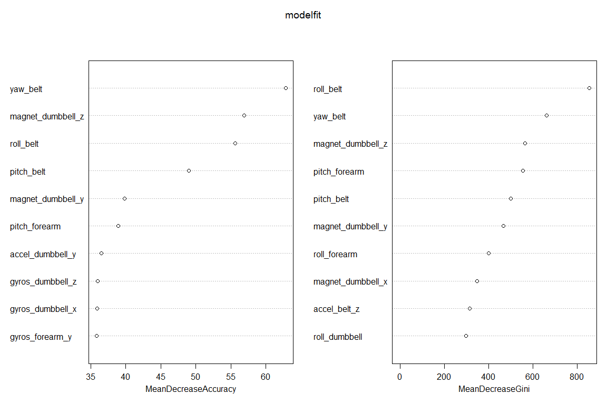

# Practical Machine Learning--Final Project
Allan Ryan  
October 20, 2017  


## Objectives and Modelling Strategy
The objective of the exercise is to categorize or develop a classification prediction of what type of dumbbell exercise was cunducted by individuals based only on movement measurements. The original data is comprised of 19,622 observations of 160 variables. In order to develop a prediction model of "classe", a factor variable with five values (A, B, C, D, E), the data was broken into a training set ("newtraining") of 70% of the data and a validation set of 30% of the data. Once a model was developed it was used to predict the missing values of "classe" in a sample of 20 observations of the same 160 variables.

Once the data had been read I employed a three step strategy to prepare the data for a first stage model. These steps were as follows:
1. Use "nearZeroVar" to allow for filtering out variables with low information content. 
2. Use manual review of remaining variables with significant (in fact any) missing values and to remove them from consideration.
3. Use advice from the course discussion thread and judgment to drop the first six columns with information such as names, timestamps and window information.

In the first instance I attempted modelling/predicting using a basic random forest model. When these failed I went back to the dataset and discovered and eliminated additional columns with missing data. With the remaining 52 columns, with no other preprocessing the random forest model achieved perfect accuracy in both the validation and test sets (confirmed by predicting all 20 values in the quiz) in the first iteration.


```r
library(rattle)
library(downloader)
library(caret)
library(tidyverse)
library(AppliedPredictiveModeling)
library( randomForest)

setwd("~/machine learning/project/PRACTICALMACHINELEARNING")

ifelse(!dir.exists("~/machine learning/project"), dir.create("~/machine learning/project"), FALSE)
```

```
## [1] FALSE
```

```r
setwd("~/machine learning/project")

download("https://d396qusza40orc.cloudfront.net/predmachlearn/pml-training.csv", "training.csv")
download("https://d396qusza40orc.cloudfront.net/predmachlearn/pml-testing.csv", "testing.csv")

training <- read.csv("training.csv")


testing <- read.csv("testing.csv")

new <- nearZeroVar(training)
newtraining <- training[-new]
newtraining <- select(newtraining,1:9,27:100)
newtraining <- select(newtraining,1:22,23:32,37:39,46,57:68,72,74:83)
newtraining <- select(newtraining,7:59)
newtraining <- select(newtraining,1:16,18:53)

inTrain = createDataPartition(newtraining$classe, p = 0.7, list = FALSE)
newtraining = newtraining[ inTrain,]
pretesting = newtraining[-inTrain,]
```

## The model and validation


```r
set.seed(125)
modelfit <- randomForest(classe ~ ., data = newtraining, importance=TRUE,
                         proximity=TRUE)
predictions <- predict(modelfit, newdata = pretesting)
table(observed = pretesting$classe, predicted = predictions) 
```

```
##         predicted
## observed    A    B    C    D    E
##        A 1177    0    0    0    0
##        B    0  795    0    0    0
##        C    0    0  710    0    0
##        D    0    0    0  690    0
##        E    0    0    0    0  772
```

```r
testpred <- predict(modelfit, newdata = testing)

newdf <- data.frame(predictions,pretesting$classe)

confusionMatrix(predictions,pretesting$classe)
```

```
## Confusion Matrix and Statistics
## 
##           Reference
## Prediction    A    B    C    D    E
##          A 1177    0    0    0    0
##          B    0  795    0    0    0
##          C    0    0  710    0    0
##          D    0    0    0  690    0
##          E    0    0    0    0  772
## 
## Overall Statistics
##                                      
##                Accuracy : 1          
##                  95% CI : (0.9991, 1)
##     No Information Rate : 0.284      
##     P-Value [Acc > NIR] : < 2.2e-16  
##                                      
##                   Kappa : 1          
##  Mcnemar's Test P-Value : NA         
## 
## Statistics by Class:
## 
##                      Class: A Class: B Class: C Class: D Class: E
## Sensitivity             1.000   1.0000   1.0000   1.0000   1.0000
## Specificity             1.000   1.0000   1.0000   1.0000   1.0000
## Pos Pred Value          1.000   1.0000   1.0000   1.0000   1.0000
## Neg Pred Value          1.000   1.0000   1.0000   1.0000   1.0000
## Prevalence              0.284   0.1918   0.1713   0.1665   0.1863
## Detection Rate          0.284   0.1918   0.1713   0.1665   0.1863
## Detection Prevalence    0.284   0.1918   0.1713   0.1665   0.1863
## Balanced Accuracy       1.000   1.0000   1.0000   1.0000   1.0000
```

```r
confusionMatrix(predictions,pretesting$classe)$overall['Accuracy']
```

```
## Accuracy 
##        1
```


## Model features
An attempt to penetrate the black box features of random forest modelling was made by invoking the varImpPlot function from the randomForest package. The results are displayed below:


```r
varImpPlot(modelfit,sort=TRUE, n.var=10)
```

<!-- -->

## Reduced tree models
The top 10 features in both of the graphs above were used as skeletons for simple tree prediction models. As reported below neither of these models are anywhere near accurate to use in actual prediction.


```r
modelfit.rp <- train(classe ~ yaw_belt + roll_belt + magnet_dumbbell_z + pitch_belt +
                    magnet_dumbbell_y +pitch_forearm + accel_dumbbell_y +magnet_forearm_z +
                    gyros_forearm_y +gyros_arm_y
                    , 
                  data = newtraining, method ="rpart")

predictions.rp <- predict(modelfit.rp, newdata = pretesting)

confusionMatrix(predictions.rp,pretesting$classe)$overall['Accuracy']
```

```
##  Accuracy 
## 0.5142375
```

```r
modelfit.rp2 <- train(classe ~  roll_belt +yaw_belt +  pitch_forearm + magnet_dumbbell_z + 
                       magnet_dumbbell_y + pitch_belt + roll_forearm + magnet_dumbbell_x +
                       accel_belt_z +magnet_belt_z
                     , 
                     data = newtraining, method ="rpart")

predictions.rp2 <- predict(modelfit.rp2, newdata = pretesting)
confusionMatrix(predictions.rp2,pretesting$classe)$overall['Accuracy']
```

```
##  Accuracy 
## 0.5007239
```


## Cross Validation
Numerous sources (many cited in the discussion thread) argue that explicit cross-validation is unnecessary with random forest models because cross-validation is implicitly conducted through the random forest sampling algorithms. Given that the specific model reported above produces perfect accuracy in the training, test and validation samples the need for explicit cross-validation is even less indicated. Nevertheless, use of the package rfUtilities does allow for this further step. The process is computationally demanding and once completed rendered no new insights.


```
library(rfUtilities)
set.seed(125)

modelfit.cf <- rf.crossValidation(modelfit, newtraining, p=0.10, n= 99)

confusionMatrix(predictions,pretesting$classe)


```
